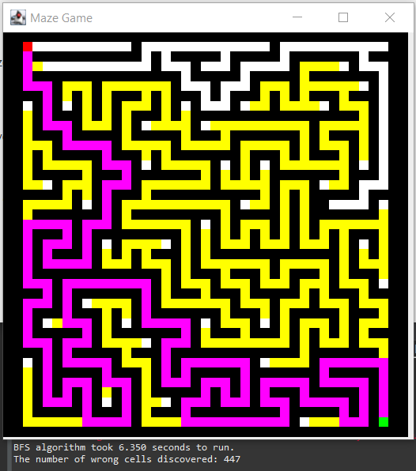

# Final Project - Maze Navigation System
This project is a Maze Navigation System that compares the performance of 3 algortihms (A*, BFS, Dijkstra's).
It aims to show the efficacy and efficiency of each algorithm and what situations they are best in.

## Table of Contents
* [General Information](#general-information)
* [Technologies Used](#technologies-used)
* [Features](#features)
* [Setup](#setup)
* [Screenshots](#screenshots)

## General Information
This maze navigation system compares the completion time and number of wrong turns for each algorithm against varying grid sizes.

The user is able to select what Maze Generation algorithm they would like alongside the acommpanying search algorithm, 
they are then able to select a grid size above 5 (as there needs to be a start node, end node, wall and one valid cell path).
The maze will then generate a random construct and search the maze with a yellow colour. 
When the goal node is found, the algorithm backtracks through the maze in a purple colour showing the shortest path.
Additionally, it prints to the command line both the completion time and the number of wrong paths discovered.

This project has a wide spectrum of functionalities, which are expanded on in the [Features](#features) section.

## Technologies Used
### Backend
* Java

### Frontend
* SceneBuilder
* SWING

### IDEs
* Eclipse

### OS
* Windows
###### Mac, particularly the M1 chipset does not support SWING so it is incompatible with my project

## Features
### A* Algorithm 
An algorithm that uses the Manhattan heuristic function to guide its search pattern
### Dijkstra's Algorithm
A greedy algorithm that iteratively picks the closest immediate path.
### Breadth-First Search 
A systematic search algorithm that explores all neighbors of a node before moving to the next level
### Recursive Backtracking
A recursive maze generation algorithm that systematically explores all possible paths, backtracking when it reaches a dead end.

## Setup

1. Install Eclipse and the Maven framework.
2. Download the project from GitLab.
3. Run Maven Install on the POM file.
4. In the IDE, run "clean compile javafx:run".

Here is a setup video for further clarity:
https://youtu.be/NPsmeY4GxRI

## Screenshots

Here is a screenshot from the project to give you an idea of how I have structured the system:

To explore all the pages, view the video in which we explain every aspect of the system.

Here is a Video showing how to use the program:
https://youtu.be/WNpDfQYNhdM
